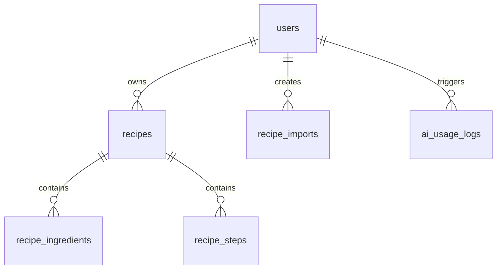

# 上线版数据库与接口设计

## 目标

把当前食谱网站升级为可以给别人使用的正式产品，并满足以下要求：

- 用户可以注册、登录、保存自己的食谱
- 用户可以使用 AI 智能整理
- 用户之间的数据隔离
- 平台可以控制 AI 调用成本
- 后续可以开放 API / SDK / 插件接入

## 推荐技术栈

- 前端：当前网站
- 后端：Node.js + Express
- 数据库：PostgreSQL
- 认证：Supabase Auth
- AI：OpenAI Responses API + Structured Outputs
- 部署：
  - 前端：Vercel
  - 后端：Render
  - 数据库：Supabase Postgres

## 核心数据模型

### 1. `users`

如果直接使用 Supabase Auth，可以不手动建完整用户认证表，但建议额外维护自己的业务用户资料表。

```sql
create table users (
  id uuid primary key,
  email text unique,
  nickname text,
  avatar_url text,
  plan text not null default 'free',
  daily_ai_limit int not null default 20,
  created_at timestamptz not null default now(),
  updated_at timestamptz not null default now()
);
```

### 2. `recipes`

存一条完整食谱的主体信息。

```sql
create table recipes (
  id uuid primary key default gen_random_uuid(),
  user_id uuid not null references users(id) on delete cascade,
  title text not null,
  source_url text,
  notes text not null default '',
  import_mode text not null default 'note',
  status text not null default 'active',
  created_at timestamptz not null default now(),
  updated_at timestamptz not null default now()
);

create index idx_recipes_user_id on recipes(user_id);
create index idx_recipes_updated_at on recipes(updated_at desc);
```

### 3. `recipe_ingredients`

材料拆表，便于后续搜索、排序和结构化管理。

```sql
create table recipe_ingredients (
  id uuid primary key default gen_random_uuid(),
  recipe_id uuid not null references recipes(id) on delete cascade,
  sort_order int not null,
  content text not null,
  created_at timestamptz not null default now()
);

create index idx_recipe_ingredients_recipe_id on recipe_ingredients(recipe_id);
```

### 4. `recipe_steps`

步骤拆表，是你当前产品的核心结构。

```sql
create table recipe_steps (
  id uuid primary key default gen_random_uuid(),
  recipe_id uuid not null references recipes(id) on delete cascade,
  sort_order int not null,
  title text not null default '',
  detail text not null default '',
  duration text not null default '',
  tip text not null default '',
  created_at timestamptz not null default now()
);

create index idx_recipe_steps_recipe_id on recipe_steps(recipe_id);
```

### 5. `recipe_imports`

记录导入原文和 AI 解析结果，方便排查问题和后续优化。

```sql
create table recipe_imports (
  id uuid primary key default gen_random_uuid(),
  user_id uuid not null references users(id) on delete cascade,
  source_url text not null default '',
  import_mode text not null default 'note',
  raw_text text not null,
  parsed_title text not null default '',
  parsed_result jsonb not null default '{}'::jsonb,
  unresolved jsonb not null default '[]'::jsonb,
  provider text not null default 'openai',
  model text not null default '',
  success boolean not null default false,
  error_message text not null default '',
  created_at timestamptz not null default now()
);

create index idx_recipe_imports_user_id on recipe_imports(user_id);
create index idx_recipe_imports_created_at on recipe_imports(created_at desc);
```

### 6. `ai_usage_logs`

做额度控制和成本分析一定要有。

```sql
create table ai_usage_logs (
  id uuid primary key default gen_random_uuid(),
  user_id uuid not null references users(id) on delete cascade,
  endpoint text not null,
  provider text not null default 'openai',
  model text not null,
  request_chars int not null default 0,
  success boolean not null default false,
  error_code text not null default '',
  created_at timestamptz not null default now()
);

create index idx_ai_usage_logs_user_id on ai_usage_logs(user_id);
create index idx_ai_usage_logs_created_at on ai_usage_logs(created_at desc);
```

## 数据关系



## 接口设计

## 认证相关

### `POST /api/auth/session`

作用：

- 前端拿到 Supabase 登录态后，换取你自己后端可识别的会话信息

请求：

```json
{
  "accessToken": "supabase_access_token"
}
```

返回：

```json
{
  "user": {
    "id": "uuid",
    "email": "demo@example.com",
    "nickname": "Demo"
  }
}
```

## 食谱接口

### `GET /api/recipes`

作用：

- 获取当前用户的食谱列表

查询参数：

- `keyword`
- `page`
- `pageSize`

返回：

```json
{
  "items": [
    {
      "id": "uuid",
      "title": "番茄炒蛋",
      "sourceUrl": "",
      "notes": "",
      "updatedAt": "2026-04-14T10:00:00.000Z",
      "ingredientsCount": 3,
      "stepsCount": 3
    }
  ],
  "total": 1
}
```

### `GET /api/recipes/:id`

作用：

- 获取一条食谱详情

返回：

```json
{
  "id": "uuid",
  "title": "番茄炒蛋",
  "sourceUrl": "",
  "notes": "",
  "ingredients": ["番茄 2个", "鸡蛋 3个", "盐 少许"],
  "steps": [
    {
      "id": "uuid",
      "title": "准备食材",
      "detail": "番茄切块，鸡蛋打散。",
      "duration": "",
      "tip": ""
    }
  ],
  "updatedAt": "2026-04-14T10:00:00.000Z"
}
```

### `POST /api/recipes`

作用：

- 创建一条新食谱

请求：

```json
{
  "title": "番茄炒蛋",
  "sourceUrl": "",
  "notes": "",
  "importMode": "note",
  "ingredients": ["番茄 2个", "鸡蛋 3个", "盐 少许"],
  "steps": [
    {
      "title": "准备食材",
      "detail": "番茄切块，鸡蛋打散。",
      "duration": "",
      "tip": ""
    }
  ]
}
```

返回：

```json
{
  "id": "uuid"
}
```

### `PATCH /api/recipes/:id`

作用：

- 更新一条食谱

请求结构和 `POST /api/recipes` 相同。

### `DELETE /api/recipes/:id`

作用：

- 删除一条食谱

返回：

```json
{
  "success": true
}
```

## AI 接口

### `POST /api/parse-recipe`

作用：

- 把原文交给 AI，提取结构化食谱

请求：

```json
{
  "rawText": "番茄炒蛋\n食材：番茄2个，鸡蛋3个，盐少许\n做法：1. 番茄切块...",
  "sourceUrl": "",
  "mode": "note"
}
```

返回：

```json
{
  "title": "番茄炒蛋",
  "sourceUrl": "",
  "ingredients": ["番茄2个", "鸡蛋3个", "盐少许"],
  "steps": [
    {
      "title": "准备食材",
      "detail": "番茄切块，鸡蛋打散。",
      "duration": "",
      "tip": ""
    }
  ],
  "notes": "",
  "unresolved": []
}
```

## AI 限额接口

### `GET /api/usage/ai`

作用：

- 获取当前用户 AI 剩余额度

返回：

```json
{
  "todayUsed": 3,
  "todayLimit": 20,
  "remaining": 17
}
```

## 后端模块拆分建议

```text
src/
  server.js
  routes/
    auth.js
    recipes.js
    ai.js
    usage.js
  controllers/
    authController.js
    recipeController.js
    aiController.js
    usageController.js
  services/
    authService.js
    recipeService.js
    aiService.js
    usageService.js
    db.js
  middlewares/
    requireAuth.js
    rateLimit.js
    errorHandler.js
  schemas/
    recipeSchema.js
    aiSchema.js
```

## AI 调用控制方案

### 免费版建议

- 每用户每天 `20` 次 AI 整理
- 单次原文长度限制 `8000` 字符
- 单 IP 每分钟限流

### 日志记录

每次调用都要记录：

- 用户 id
- 模型名称
- 原文长度
- 是否成功
- 错误码
- 时间

### 常见错误返回

```json
{
  "error": "quota_exceeded",
  "detail": "今日 AI 使用次数已达上限"
}
```

## 权限控制

必须保证：

- 用户只能读取自己的食谱
- 用户只能修改自己的食谱
- 用户只能看到自己的 AI 调用记录

## 开发顺序建议

1. 接入 Supabase Auth
2. 建表
3. 实现 `POST /api/parse-recipe`
4. 实现 `POST /api/recipes`
5. 实现 `GET /api/recipes`
6. 实现 `GET /api/recipes/:id`
7. 实现更新和删除
8. 实现 `GET /api/usage/ai`
9. 加限流和日志

## 最小上线范围

第一版上线只要有这些就够：

- 登录
- AI 整理
- 保存食谱
- 食谱列表
- 食谱详情
- 每日 AI 次数限制
