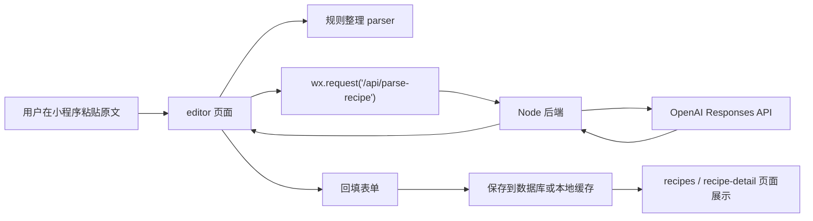

# 微信小程序版本骨架设计

## 目标

把当前食谱网站迁移成一个原生微信小程序，并保留以下核心能力：

- 结构化录入菜名、材料、做法步骤
- 粘贴分享文案后做规则整理
- 调用 AI 接口做智能整理
- 保存食谱、查看食谱、编辑食谱
- 为后续登录、云端同步、分享和图片上传预留空间

## 迁移原则

1. 保留后端
   现有 `server.mjs` 中的 AI 解析能力继续保留，小程序只负责调用接口。
2. 重写前端
   当前 H5 的 `index.html`、`styles.css`、`script.js` 不直接迁移到小程序，改为原生小程序页面。
3. 先做单端可用，再做账号体系
   第一阶段先把录入、AI 整理、保存/浏览打通，第二阶段再加微信登录和云同步。
4. 数据结构不变
   `title`、`ingredients`、`steps`、`notes`、`sourceUrl` 继续作为统一数据模型。

## 推荐目录

建议在仓库中新增一个小程序目录，而不是直接覆盖当前网站文件。

```text
miniprogram/
  app.js
  app.json
  app.wxss
  sitemap.json
  components/
    import-panel/
      index.js
      index.json
      index.wxml
      index.wxss
    step-editor/
      index.js
      index.json
      index.wxml
      index.wxss
    recipe-card/
      index.js
      index.json
      index.wxml
      index.wxss
  pages/
    editor/
      index.js
      index.json
      index.wxml
      index.wxss
    recipes/
      index.js
      index.json
      index.wxml
      index.wxss
    recipe-detail/
      index.js
      index.json
      index.wxml
      index.wxss
    profile/
      index.js
      index.json
      index.wxml
      index.wxss
  services/
    api.js
    auth.js
    recipe.js
  utils/
    formatter.js
    parser.js
    storage.js
  assets/
    icons/
```

## 页面骨架

### 1. `pages/editor/index`

这是小程序的主页面，承接现在网站里的核心能力。

包含区域：

- 导入方式选择
  - 完整笔记
  - 分享文案
  - 口语教程整理
- 分享链接输入
- 原文输入
- `规则整理` 按钮
- `AI 智能整理` 按钮
- 识别结果检查区
- 菜名输入
- 来源链接输入
- 材料输入
- 备注输入
- 步骤编辑器
- 保存食谱按钮
- 当前内容预览

### 2. `pages/recipes/index`

用于展示“我的食谱库”。

包含能力：

- 搜索食谱
- 卡片列表展示
- 编辑入口
- 删除入口
- 后续增加筛选、分类

### 3. `pages/recipe-detail/index`

用于专门查看一道菜。

包含能力：

- 展示菜名
- 展示来源链接
- 展示材料
- 展示步骤
- 展示备注
- 支持收藏、分享、复制链接

### 4. `pages/profile/index`

用于未来扩展账号能力。

第一阶段可以先放占位内容：

- 用户昵称头像
- 我的食谱数量
- AI 调用次数
- 设置

## 组件骨架

### `components/import-panel`

职责：

- 管理导入文本类型
- 管理原文输入
- 触发规则整理
- 触发 AI 整理
- 展示识别结果检查区

输入属性：

- `loading`
- `parsedTitle`
- `parsedPlatform`
- `parsedIngredientCount`
- `parsedStepCount`
- `unresolvedText`

输出事件：

- `import-rule`
- `import-ai`
- `change-mode`
- `change-link`
- `change-text`

### `components/step-editor`

职责：

- 展示步骤列表
- 新增步骤
- 删除步骤
- 上移/下移步骤
- 编辑单步标题、动作、时长、提示

输入属性：

- `steps`

输出事件：

- `add-step`
- `remove-step`
- `move-step`
- `update-step`

### `components/recipe-card`

职责：

- 食谱列表卡片展示
- 展示菜名、更新时间、来源
- 触发编辑或查看详情

## 页面数据结构

小程序端建议统一使用如下数据结构：

```js
{
  id: "recipe-123",
  title: "番茄炒蛋",
  sourceUrl: "https://...",
  notes: "最后注意别炒太老",
  ingredients: ["番茄 2个", "鸡蛋 3个", "盐 少许"],
  steps: [
    {
      title: "准备食材",
      detail: "番茄切块，鸡蛋打散备用。",
      duration: "5分钟",
      tip: "鸡蛋可以先加一点盐。"
    }
  ],
  updatedAt: 1713050000000
}
```

## 小程序与后端的数据流



## 服务层设计

### `services/api.js`

统一封装请求：

- `request(options)`
- 自动处理 `baseURL`
- 自动处理错误 toast
- 后续可加 token

### `services/recipe.js`

封装食谱接口：

- `parseRecipeWithAi(payload)`
- `saveRecipe(payload)`
- `fetchRecipes()`
- `fetchRecipeDetail(id)`
- `updateRecipe(id, payload)`
- `deleteRecipe(id)`

### `services/auth.js`

第二阶段接入：

- `loginWithWechatCode()`
- `getCurrentUser()`
- `logout()`

## 小程序端状态方案

第一阶段建议使用页面局部状态，不必一开始上全局状态库。

- `editor` 页面维护表单状态
- `recipes` 页面维护列表状态
- `App.globalData` 只放基础配置

等到第二阶段加登录、额度、收藏后，再考虑抽全局状态。

## 迁移映射

### 当前网站功能到小程序的映射

- `importSharedContent()` -> `utils/parser.js + editor 页面方法`
- `importWithAi()` -> `services/recipe.js.parseRecipeWithAi`
- `renderStepsBuilder()` -> `components/step-editor`
- 本地存储 -> `utils/storage.js`
- `recipe list` -> `pages/recipes/index`

## 第一阶段开发顺序

1. 新建 `miniprogram/` 目录和基础 `app.*`
2. 完成 `pages/editor/index`
3. 完成 `components/step-editor`
4. 接通 `/api/parse-recipe`
5. 接通本地缓存保存
6. 完成 `pages/recipes/index`
7. 完成 `pages/recipe-detail/index`

## 第二阶段开发顺序

1. 部署线上后端
2. 配置小程序 `request` 合法域名
3. 接入 `wx.login`
4. 引入数据库
5. 改为按用户保存食谱

## 风险点

### 1. 小程序不能请求本地地址

`localhost` 和 `127.0.0.1` 只适合本地网站调试，小程序真机必须请求线上 HTTPS 域名。

### 2. 域名要求

小程序请求后端时，需要在微信后台配置 `request` 合法域名。正式环境下通常要求 HTTPS 域名，并符合微信后台规则。

### 3. OpenAI Key 不能下发到小程序

AI 请求必须从你自己的后端发起，小程序只请求你的后端。

## 第一版最小可交付范围

建议先交付这一版：

- 一个食谱录入页
- 一个食谱列表页
- 一个详情页
- 规则整理
- AI 整理
- 本地缓存保存

这样开发速度快，也能先用微信开发者工具验证完整路径。
